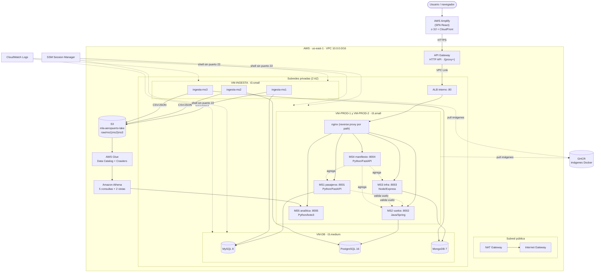

# Arquitectura de solución — boceto (DA-01)

Boceto v0 de la topología, para alinear al equipo en F0. Se mantiene actualizado hasta que en **F2**
se produzca el `arquitectura-solucion.drawio` + PNG final para el informe (DA-03).

Fuente de verdad: [`docs/arquitectura.md`](../docs/arquitectura.md) · decisiones pendientes en
[`docs/aws-learner-lab-hallazgos.md`](../docs/aws-learner-lab-hallazgos.md).

## Capas (para el diagrama final)

| Capa | Elementos |
|---|---|
| Red | VPC, 2 subredes públicas, 2 privadas, IGW, NAT, 5 Security Groups, API Gateway + VPC Link, ALB interno |
| Cómputo Backend | EC2 ×2 VM-PROD (nginx + MS1..MS5) |
| Datos Backend | EC2 VM-DB (MySQL + PostgreSQL + MongoDB) |
| Data Science | EC2 VM-INGESTA → S3 → Glue → Athena → MS5 |
| Frontend | Amplify (o S3 + CloudFront) → API Gateway |
| Operación | SSM Session Manager, CloudWatch Logs |
| Externo | GHCR (registro de imágenes) |

## Flujos

1. `Usuario → Amplify → API Gateway (HTTPS) → VPC Link → ALB → nginx → MSx`
2. `MS1→MySQL`, `MS2→PostgreSQL`, `MS3→MongoDB`; `MS1/MS3→MS2` (valida vuelo); `MS4→MS1+MS2+MS3` (agrega)
3. `VM-INGESTA → S3 (raw/msX/)` (pull 100%, una vez)
4. `S3 → Glue crawlers → aeropuerto_lake → Athena → MS5`

## Pendiente para DA-02 / DA-03

- Confirmar **ALB vs NLB** y **VPC Link sí/no** con los hallazgos del Learner Lab.
- Reemplazar por `arquitectura-solucion.drawio` con **nombres/IDs reales** de recursos y exportar **PNG**
  para `informe/` y `ppt/` (F2).
